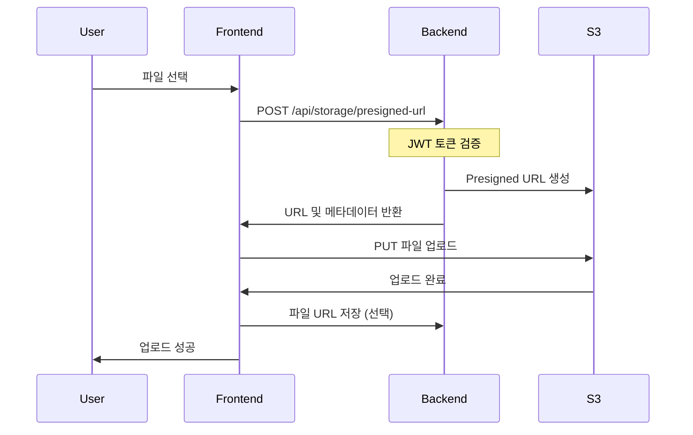

# S3 Presigned URL 업로드 가이드

## 개요
Routine-It 백엔드는 S3 Presigned URL을 사용한 직접 업로드 방식을 지원합니다. 이를 통해 클라이언트가 백엔드 서버를 거치지 않고 S3에 직접 파일을 업로드할 수 있습니다.

## API 엔드포인트

### 1. Presigned URL 생성
```
POST /api/storage/presigned-url
Authorization: Bearer {JWT_TOKEN}
Content-Type: application/json
```

**요청 본문:**
```json
{
  "fileName": "profile.jpg",
  "contentType": "image/jpeg",
  "purpose": "profile"
}
```

**파라미터 설명:**
- `fileName`: 업로드할 파일명 (필수)
- `contentType`: 파일의 MIME 타입 (필수, 이미지만 허용)
  - 허용 타입: `image/jpeg`, `image/jpg`, `image/png`, `image/gif`, `image/webp`
- `purpose`: 파일 용도 (선택, 기본값: "profile")
  - 허용 값: `profile`, `proof-shot`, `group-image`

**응답 예시:**
```json
{
  "success": true,
  "message": "Success",
  "data": {
    "uploadUrl": "https://routine-it-frontend-1757331119.s3.ap-northeast-2.amazonaws.com/...",
    "fileUrl": "https://routine-it-frontend-1757331119.s3.amazonaws.com/profile/2025/09/10/user-1/uuid.jpg",
    "objectKey": "profile/2025/09/10/user-1/uuid.jpg",
    "expiresAt": "2025-09-10T12:24:58.684401094"
  }
}
```

### 2. 파일 삭제
```
DELETE /api/storage/file?objectKey={OBJECT_KEY}
Authorization: Bearer {JWT_TOKEN}
```

## 프론트엔드 구현 예시

### JavaScript/TypeScript
```javascript
async function uploadImageToS3(file, purpose = 'profile') {
  const token = localStorage.getItem('accessToken');
  
  // Step 1: Presigned URL 요청
  const presignedResponse = await fetch('http://localhost:8080/api/storage/presigned-url', {
    method: 'POST',
    headers: {
      'Authorization': `Bearer ${token}`,
      'Content-Type': 'application/json'
    },
    body: JSON.stringify({
      fileName: file.name,
      contentType: file.type,
      purpose: purpose
    })
  });

  const presignedData = await presignedResponse.json();
  const { uploadUrl, fileUrl, objectKey } = presignedData.data;

  // Step 2: S3에 직접 업로드
  const uploadResponse = await fetch(uploadUrl, {
    method: 'PUT',
    headers: {
      'Content-Type': file.type
    },
    body: file
  });

  if (uploadResponse.ok) {
    return { fileUrl, objectKey };
  }
  
  throw new Error('Upload failed');
}
```

### React 컴포넌트 예시
```jsx
function ImageUpload() {
  const [imageUrl, setImageUrl] = useState(null);
  const [uploading, setUploading] = useState(false);

  const handleFileChange = async (e) => {
    const file = e.target.files[0];
    if (!file) return;

    setUploading(true);
    try {
      const result = await uploadImageToS3(file);
      setImageUrl(result.fileUrl);
      // 백엔드에 이미지 URL 저장
      await saveImageUrlToBackend(result.fileUrl);
    } catch (error) {
      console.error('Upload failed:', error);
    } finally {
      setUploading(false);
    }
  };

  return (
    <div>
      <input 
        type="file" 
        accept="image/*" 
        onChange={handleFileChange}
        disabled={uploading}
      />
      {imageUrl && }
    </div>
  );
}
```

## 업로드 플로우



## 주요 특징

### 장점
- **서버 부하 감소**: 파일이 백엔드를 거치지 않음
- **대용량 파일 지원**: 타임아웃 문제 없음
- **업로드 진행률 추적**: 클라이언트에서 직접 구현 가능
- **보안**: Presigned URL은 제한된 시간만 유효

### 제한사항
- **URL 유효기간**: 15분 (서버 설정)
- **파일 타입**: 이미지 파일만 허용
- **파일 크기**: 클라이언트에서 제한 필요

## 에러 처리

### 일반적인 에러 코드
- `401 Unauthorized`: JWT 토큰 없음 또는 만료
- `400 Bad Request`: 잘못된 파일 타입 또는 파라미터
- `500 Internal Server Error`: S3 연결 실패

### 에러 처리 예시
```javascript
try {
  const result = await uploadImageToS3(file);
} catch (error) {
  if (error.status === 401) {
    // 토큰 갱신 또는 재로그인
    await refreshToken();
  } else if (error.status === 400) {
    alert('지원하지 않는 파일 형식입니다.');
  } else {
    alert('업로드 중 오류가 발생했습니다.');
  }
}
```

## 보안 고려사항

1. **파일 검증**: 클라이언트와 서버 모두에서 파일 타입 검증
2. **크기 제한**: 클라이언트에서 업로드 전 파일 크기 확인
3. **토큰 관리**: JWT 토큰 안전하게 저장 및 관리
4. **CORS 설정**: S3 버킷에 적절한 CORS 정책 설정 필요

## 테스트 방법

### cURL을 사용한 테스트
```bash
# 1. Presigned URL 생성
curl -X POST http://localhost:8080/api/storage/presigned-url \
  -H "Authorization: Bearer YOUR_JWT_TOKEN" \
  -H "Content-Type: application/json" \
  -d '{
    "fileName": "test.jpg",
    "contentType": "image/jpeg",
    "purpose": "profile"
  }'

# 2. 받은 uploadUrl로 파일 업로드
curl -X PUT "PRESIGNED_URL_HERE" \
  -H "Content-Type: image/jpeg" \
  --data-binary @test.jpg
```

## 환경 설정

### 필요한 환경 변수 (.env)
```bash
# AWS S3 Configuration
AWS_ACCESS_KEY_ID=your_access_key
AWS_SECRET_ACCESS_KEY=your_secret_key
AWS_REGION=ap-northeast-2
S3_BUCKET_NAME=your_bucket_name
```

### Docker Compose 설정
docker-compose.yml에 AWS 환경 변수가 포함되어 있는지 확인:
```yaml
environment:
  - AWS_ACCESS_KEY_ID=${AWS_ACCESS_KEY_ID}
  - AWS_SECRET_ACCESS_KEY=${AWS_SECRET_ACCESS_KEY}
  - AWS_REGION=${AWS_REGION}
  - AWS_S3_BUCKET=${S3_BUCKET_NAME}
```

## 문의사항
문제가 발생하거나 추가 기능이 필요한 경우 백엔드 팀에 문의하세요.